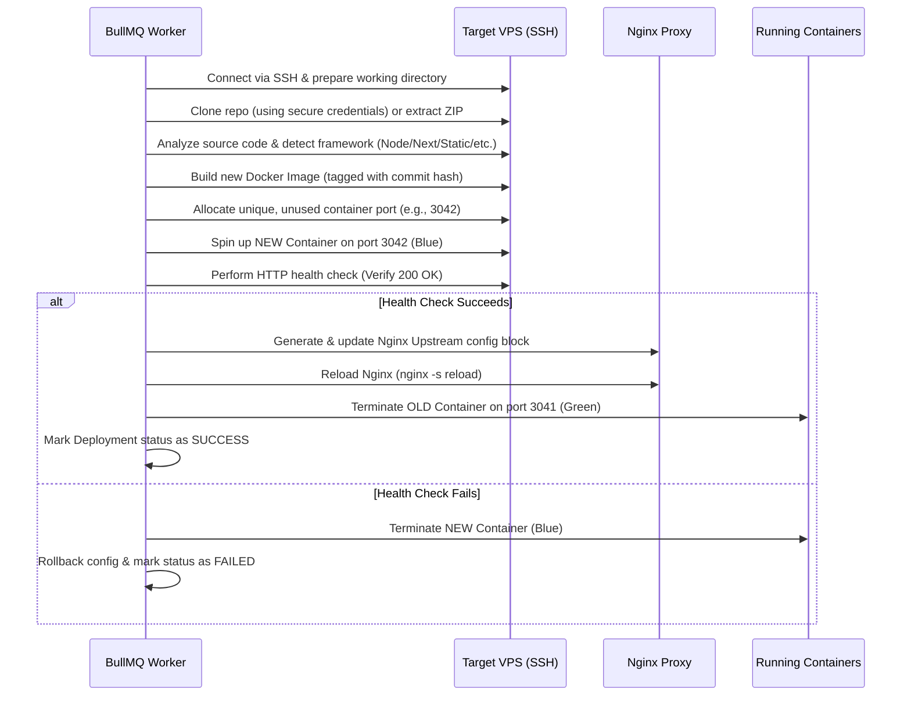

# 🏗️ DeployForge Architectural Specifications

DeployForge is engineered on the principle of separating control management (Control Plane) from application execution environments (Data Plane). This document details the component architecture, monorepo layout, communication pipelines, and deployment lifecycles.

---

## 1. High-Level Architecture Model

DeployForge acts as a central control hub. Instead of installing heavy daemon agents on target environments, the platform connects agentlessly to standard Linux VPS nodes over SSH, using Docker for isolation and Nginx for routing.

```mermaid
graph TD
    User((Developer)) -->|HTTPS| WebApp[Next.js Frontend]
    WebApp -->|REST API & WS| API[Fastify Backend]
    
    subgraph Control Plane
        API --> DB[(PostgreSQL)]
        API --> Cache[(Redis Cache / Broker)]
        API --> Queue[BullMQ Work Queue]
        Queue --> Worker[Deployment Worker]
    end
    
    subgraph Data Plane (Target VPS)
        Worker -->|SSH Connection Tunnel| VPS[Target Ubuntu VPS]
        VPS -->|Nginx| Proxy[Nginx Reverse Proxy]
        Proxy -->|Port Mapping| Containers[Sandboxed App Containers]
    end
    
    subgraph External
        API <--> GitHub[GitHub API / Webhooks]
        Proxy <--> LetEncrypt[Let's Encrypt CA]
    end
```

### 1.1 The Control Plane (Central Orchestrator)
Responsible for user management, webhook event handling, build orchestration, state auditing, and server statistics aggregation.
* **Next.js Web App (`apps/web`):** Built with React 18, Zustand, and Tailwind CSS. Structured with public portals, protected developer consoles, and secure admin dashboards.
* **Fastify Server (`apps/api`):** Built with Fastify. Houses services for user authentication, SSH command orchestration, project configurations, and sandbox executions.
* **BullMQ Task Processor:** Directs async server setups, framework detection, docker builds, and metrics polls. Offloads heavy operations from the main HTTP request loop.
* **Redis Cache & Broker:** Serves as the message broker for BullMQ and stores ephemeral session caching.
* **PostgreSQL & Prisma:** Core system metadata repository. Includes relational schemas for projects, deployments, domains, servers, user tokens, and security trails.

### 1.2 The Data Plane (User Virtual Private Servers)
The remote hosting environment where user applications execute.
* **Agentless SSH-Driven Design:** The Control Plane communicates with Data Plane nodes entirely over secure SSH connections (managed via the Node `ssh2` client). There are no agents to update or configure on the target machines.
* **Docker Container Sandboxing:** User applications are isolated in Docker container runtimes. Containers are initialized using defensive security profiles (dropped kernel capabilities and no privilege escalation) to minimize attack surfaces.
* **Dynamic Nginx Ingress & SSL Routing:** An Nginx instance on each target VPS handles inbound public traffic. When an application container boots, DeployForge dynamically rewrites the upstream routing configurations to map the project's domains to the active container port. Certbot manages TLS certificates and sets up secure HTTPS server blocks.

---

## 2. Monorepo Structural Blueprint

DeployForge uses a Turborepo monorepo configuration:

```text
DeployForge/
├── apps/
│   ├── api/                  # Fastify Backend Server
│   └── web/                  # Next.js App Router Frontend
├── packages/
│   ├── database/             # Shared Prisma Client & Models
│   ├── mail/                 # Transactional Email Templates & Transport
│   ├── security/             # AES-256-GCM & Argon2id Crypto Library
│   ├── shared/               # Shared API Contracts, Schemas & Errors
│   └── vps/                  # SSH Shell & Remote File Transfer Lib
└── prisma/                   # PostgreSQL Schema definitions
```

* **`packages/security`:** Encapsulates the application's security primitives. Handles AES-256-GCM encryption for stored secrets (private keys, passwords, access tokens), Argon2id hashing for user passwords, and JWT session signatures.
* **`packages/vps`:** Standardizes remote execution patterns. Connects to target systems, runs shell commands with prototype-safe shell escaping, and transfers archives over SFTP.
* **`packages/database`:** Shares a single database client configuration across API, migrations, and backend worker contexts.
* **`packages/mail`:** Standardizes transactional mail dispatching (e.g., registration verification OTPs and password reset triggers).
* **`packages/shared`:** Houses API contracts, input validation schemas, unified errors, and shared utility functions.

---

## 3. Core Execution Workflows

### 3.1 Blue-Green Deployment (Zero-Downtime Releases)
To prevent service interruptions during deployments, DeployForge utilizes a Blue-Green deployment pattern:



### 3.2 Automated Metrics Collection
1. **Cron Schedule:** Every 60 seconds, a background job scheduler publishes metrics collection tasks to BullMQ.
2. **SSH Connection:** The worker opens an SSH tunnel to each active VPS in the system.
3. **Execution:** Runs native commands:
   - `top -b -n 1` (CPU and RAM consumption)
   - `df -h` (Disk volume details)
   - `docker stats --no-stream` (Container metrics)
4. **Ingress:** Formats and writes the metrics logs to PostgreSQL, making them available for dashboard charts.
