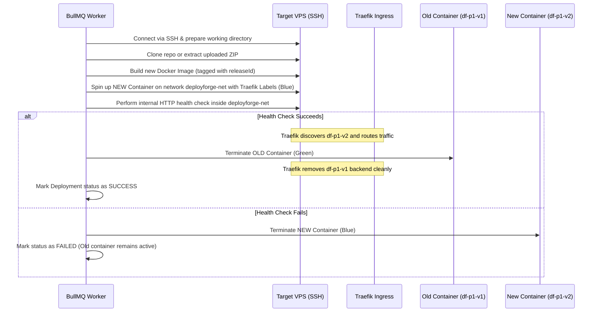

# 🏗️ DeployForge Architectural Specifications

DeployForge is engineered on the principle of separating control management (Control Plane) from application execution environments (Data Plane). This document details the component architecture, monorepo layout, communication pipelines, and multi-tenant deployment lifecycles.

---

## 1. High-Level Architecture Model

DeployForge acts as a central control hub. Instead of installing heavy daemon agents on target environments, the platform connects agentlessly to standard Linux VPS nodes over SSH. It initializes a persistent **Traefik Ingress Gateway** and an isolated virtual bridge network (`deployforge-net`), allowing multiple independent applications and static sites to co-exist securely on a single VPS without host port collisions.

```mermaid
graph TD
    User((Developer)) -->|HTTPS| WebApp[Next.js Frontend]
    WebApp -->|REST API & WS| API[Fastify Backend]
  
    subgraph Control Plane
        API --> DB[(PostgreSQL)]
        API --> Cache[(Redis Cache / Broker)]
        API --> Queue[BullMQ Work Queue]
        Queue --> Worker[Deployment Worker]
    end
  
    subgraph "Data Plane (Target Linux VPS)"
        Worker -->|SSH Connection Tunnel| VPS[Target Ubuntu VPS]
        VPS -->|Host Ports 80 & 443| Traefik[Traefik Ingress Gateway]
        Traefik -->|deployforge-net (172.28.0.0/16)| Containers[Sandboxed App & Static Containers]
    end
  
    subgraph External
        API <--> GitHub[GitHub API / Webhooks]
        Traefik <--> LetEncrypt[Let's Encrypt ACME]
    end
```

### 1.1 The Control Plane (Central Orchestrator)

Responsible for user management, webhook event handling, build orchestration, state auditing, and server statistics aggregation.

* **Next.js Web App (`apps/web`):** Built with React 18, Zustand, and Tailwind CSS. Structured with public portals, protected developer consoles, and secure admin dashboards.
* **Fastify Server (`apps/api`):** Built with Fastify. Houses services for user authentication, SSH command orchestration, project configurations, and runtime detections.
* **BullMQ Task Processor:** Directs async server setups, framework detection, docker builds, and metrics polls. Offloads heavy operations from the main HTTP request loop.
* **Redis Cache & Broker:** Serves as the message broker for BullMQ and stores ephemeral session caching.
* **PostgreSQL & Prisma:** Core system metadata repository. Includes relational schemas for projects, project memberships (RBAC), invitations, deployments, domains, servers, user tokens, and security trails.

### 1.2 The Data Plane (Multi-Tenant Target VPS)

The remote hosting environment where user applications execute.

* **Agentless SSH-Driven Control:** The Control Plane communicates with Data Plane nodes entirely over secure SSH connections (managed via the Node `ssh2` client).
* **Traefik Ingress Controller:** A lightweight, persistent Traefik container (`deployforge-traefik`) binds exclusively to host ports 80 and 443. It automatically discovers active application containers by listening to `/var/run/docker.sock`.
* **Internal Docker Virtual Bridge (`deployforge-net`):** All tenant containers attach to `deployforge-net`. No container ever publishes host ports directly (eliminating `PORT_IN_USE` collisions across different projects).
* **Label-Driven Routing & Automated TLS:** Routing rules are declared dynamically via Docker container labels. Traefik automatically provisions and renews Let's Encrypt TLS certificates using ACME HTTP-01 challenges.
* **Magic DNS Support:** When a user deploys without a custom domain, DeployForge assigns `<projectSlug>-<deployId>.<vpsIp>.sslip.io`, which resolves immediately to the VPS with valid SSL.

---

## 2. Monorepo Structural Blueprint

DeployForge uses a Turborepo monorepo configuration:

```text
DeployForge/
├── apps/
│   ├── api/                  # Fastify Backend Server
│   └── web/                  # Next.js App Router Frontend
├── packages/
│   ├── database/             # Shared Prisma Client & Models
│   ├── mail/                 # Transactional Email Templates & Transport
│   ├── security/             # AES-256-GCM & Argon2id Crypto Library
│   ├── shared/               # Shared API Contracts, Schemas & Errors
│   └── vps/                  # SSH Shell & Remote File Transfer Lib
└── prisma/                   # PostgreSQL Schema definitions
```

* **`packages/security`:** Encapsulates the application's security primitives (AES-256-GCM encryption for stored secrets, Argon2id password hashing, and JWT signatures).
* **`packages/vps`:** Standardizes remote execution patterns over SSH, command sanitization, and SFTP transfers.
* **`packages/database`:** Shares a single database client configuration across API, migrations, and backend worker contexts.
* **`packages/mail`:** Standardizes transactional mail dispatching (e.g., registration verification OTPs and password reset triggers).
* **`packages/shared`:** Houses API contracts, input validation schemas, unified errors, and shared utility functions.

---

## 3. Core Execution Workflows

### 3.1 VPS Initialization (One-Time Bootstrap)

When a VPS is added to DeployForge:

1. Verifies/installs Docker Engine and Docker Compose.
2. Creates the shared external Docker network `deployforge-net`.
3. Launches the persistent `deployforge-traefik` container with ACME storage mounted at `/etc/deployforge/traefik/acme/acme.json`.

### 3.2 Label-Driven Zero-Downtime Deployment


```mermaid
sequenceDiagram
    participant W as BullMQ Worker
    participant V as Target VPS (SSH)
    participant T as Traefik Ingress
    participant C_OLD as Old Container (df-p1-v1)
    participant C_NEW as New Container (df-p1-v2)

    W->>V: Connect via SSH & prepare working directory
    W->>V: Clone repo or extract uploaded ZIP
    W->>V: Build new Docker Image (tagged with releaseId)
    W->>V: Spin up NEW Container on network deployforge-net with Traefik Labels (Blue)
    W->>V: Perform internal HTTP health check inside deployforge-net
  
    alt Health Check Succeeds
        Note over V,T: Traefik discovers df-p1-v2 and routes traffic
        W->>C_OLD: Terminate OLD Container (Green)
        Note over V,T: Traefik removes df-p1-v1 backend cleanly
        W->>W: Mark Deployment status as SUCCESS
    else Health Check Fails
        W->>C_NEW: Terminate NEW Container (Blue)
        W->>W: Mark status as FAILED (Old container remains active)
    end
```

### 3.3 Automated Metrics Collection

1. **Cron Schedule:** Every 60 seconds, a background job scheduler publishes metrics collection tasks to BullMQ.
2. **SSH Connection:** The worker opens an SSH tunnel to each active VPS in the system.
3. **Execution:** Runs native commands (`top -b -n 1`, `df -h`, `docker stats --no-stream`).
4. **Ingress:** Formats and writes the metrics logs to PostgreSQL, making them available for dashboard monitoring.
