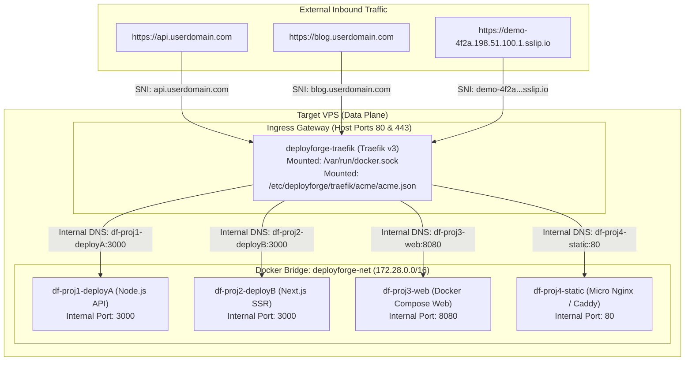
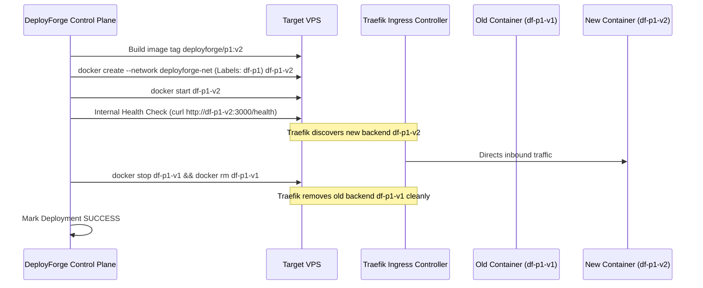

# 🚀 Traefik + Shared Docker Network Multi-Site Architecture Specification

## 1. Executive Summary

This document specifies the target Data Plane architecture for running **multiple isolated projects, containers, and static sites concurrently on a single Linux VPS** using:
1. A **one-time VPS Bootstrap** that installs Docker, provisions a shared external bridge network (`deployforge-net`), and launches a persistent **Traefik v3 reverse proxy container**.
2. **Zero host port mappings** (`-p hostPort:appPort` is eliminated). All container runtimes communicate over `deployforge-net`.
3. **Dynamic container routing via Docker labels**, completely removing brittle Nginx configuration files, `nginx -t` global reload risks, and manual Certbot commands.
4. **Automatic Let's Encrypt SSL/TLS** certificates via Traefik's native ACME HTTP-01 and TLS-ALPN-01 resolvers.
5. **Magic DNS Subdomain fallback** (`<project-slug>-<shortDeployId>.<vps-ip>.sslip.io`) enabling immediate multi-site deployment without requiring user-configured custom domains.

---

## 2. Architectural Comparison

| Dimension | Legacy Nginx File Model (Deprecated) | Target Traefik Network Model (Active) |
| :--- | :--- | :--- |
| **Ingress Engine** | Host-installed Nginx daemon | Isolated Traefik v3 Docker container |
| **Port Allocation** | Database port pool (3000–9000), `ss -ltn` checks | **None**. Containers only expose internal ports |
| **Routing Definition** | Brittle `/etc/nginx/conf.d/*.conf` files | Declarative **Docker Container Labels** |
| **Global Blast Radius** | High (one broken `.conf` fails `nginx -t` for all sites) | **Zero** (routing is scoped strictly per container) |
| **SSL / TLS Termination** | `certbot --nginx` CLI executing in-place file mutations | **Native Traefik ACME** reading/writing `/acme.json` |
| **Docker Compose Stacks** | Conflicts if 2 projects bind `3000:3000` or `80:80` | **Conflict-free**; services join `deployforge-net` |
| **Public Surface Area** | Raw ports (e.g. `3042`) exposed to public internet | **Only ports 80 and 443 are exposed** on the host |

---

## 3. High-Level Data Plane Topology



---

## 4. VPS Initialization Lifecycle (One-Time Bootstrap)

When a VPS is connected to DeployForge (or initialized via `POST /api/vps/:id/bootstrap`), the system runs the following idempotent operations over SSH:

### Step 4.1: Ensure Docker Engine & Plugins
```bash
if ! command -v docker >/dev/null 2>&1; then
  export DEBIAN_FRONTEND=noninteractive
  curl -fsSL https://get.docker.com | sh
  systemctl enable --now docker
fi
```

### Step 4.2: Create the Shared Bridge Network
```bash
docker network inspect deployforge-net >/dev/null 2>&1 || \
docker network create \
  --driver bridge \
  --subnet 172.28.0.0/16 \
  deployforge-net
```

### Step 4.3: Prepare Persistent ACME Storage
```bash
mkdir -p /etc/deployforge/traefik/acme
touch /etc/deployforge/traefik/acme/acme.json
chmod 600 /etc/deployforge/traefik/acme/acme.json
```

### Step 4.4: Deploy or Ensure Traefik Gateway Container
```bash
if [ "$(docker inspect -f '{{.State.Running}}' deployforge-traefik 2>/dev/null)" != "true" ]; then
  docker rm -f deployforge-traefik 2>/dev/null || true
  docker run -d \
    --name deployforge-traefik \
    --restart always \
    --network deployforge-net \
    -p 80:80 \
    -p 443:443 \
    -v /var/run/docker.sock:/var/run/docker.sock:ro \
    -v /etc/deployforge/traefik/acme/acme.json:/acme.json \
    traefik:v3.1 \
    --global.sendAnonymousUsage=false \
    --api.dashboard=false \
    --providers.docker=true \
    --providers.docker.exposedbydefault=false \
    --providers.docker.network=deployforge-net \
    --entrypoints.web.address=:80 \
    --entrypoints.web.http.redirections.entrypoint.to=websecure \
    --entrypoints.web.http.redirections.entrypoint.scheme=https \
    --entrypoints.websecure.address=:443 \
    --certificatesresolvers.letsencrypt.acme.httpchallenge=true \
    --certificatesresolvers.letsencrypt.acme.httpchallenge.entrypoint=web \
    --certificatesresolvers.letsencrypt.acme.email=admin@deployforge.local \
    --certificatesresolvers.letsencrypt.acme.storage=/acme.json
fi
```

---

## 5. Project Deployment Routing Specifications

### 5.1 Standalone Containers (Node, Next.js, Python, Go, Dockerfile)

During deployment execution:
1. The container is created **without publishing host ports** (`-p` is omitted).
2. It is attached to `--network deployforge-net`.
3. Labels are injected dynamically:

```bash
docker create \
  --name df-${projectId}-${deploymentId} \
  --restart unless-stopped \
  --network deployforge-net \
  --label "traefik.enable=true" \
  --label "traefik.http.routers.df-${projectId}.rule=Host(\`${effectiveDomain}\`)" \
  --label "traefik.http.routers.df-${projectId}.entrypoints=websecure" \
  --label "traefik.http.routers.df-${projectId}.tls=true" \
  --label "traefik.http.routers.df-${projectId}.tls.certresolver=letsencrypt" \
  --label "traefik.http.services.df-${projectId}.loadbalancer.server.port=${appPort}" \
  ${imageTag}
```

### 5.2 Docker Compose Applications (Multi-Service Stacks)

For repositories using `docker-compose.yml`:
1. DeployForge generates a dynamic `docker-compose.deployforge.yml` overlay.
2. The external network `deployforge-net` is declared.
3. The routing labels are injected only into the primary ingress service:

```yaml
version: '3.8'

networks:
  deployforge-net:
    external: true

services:
  web:
    networks:
      - default
      - deployforge-net
    labels:
      - "traefik.enable=true"
      - "traefik.http.routers.df-${projectId}.rule=Host(`${effectiveDomain}`)"
      - "traefik.http.routers.df-${projectId}.entrypoints=websecure"
      - "traefik.http.routers.df-${projectId}.tls=true"
      - "traefik.http.routers.df-${projectId}.tls.certresolver=letsencrypt"
      - "traefik.http.services.df-${projectId}.loadbalancer.server.port=${webInternalPort}"
```

Executed via:
```bash
docker compose -p df_${projectId} -f docker-compose.yml -f docker-compose.deployforge.yml up -d
```

### 5.3 Static Site Projects (HTML / Vite / React / Astro)

Static sites produce build assets placed in `/home/${username}/deployforge/projects/${projectId}/static/${deploymentId}`.
A micro Nginx container serves the static directory over `deployforge-net`:

```bash
docker run -d \
  --name df-${projectId}-${deploymentId} \
  --restart unless-stopped \
  --network deployforge-net \
  -v /home/${username}/deployforge/projects/${projectId}/static/${deploymentId}:/usr/share/nginx/html:ro \
  --label "traefik.enable=true" \
  --label "traefik.http.routers.df-${projectId}.rule=Host(\`${effectiveDomain}\`)" \
  --label "traefik.http.routers.df-${projectId}.entrypoints=websecure" \
  --label "traefik.http.routers.df-${projectId}.tls=true" \
  --label "traefik.http.routers.df-${projectId}.tls.certresolver=letsencrypt" \
  --label "traefik.http.services.df-${projectId}.loadbalancer.server.port=80" \
  nginx:alpine
```

---

## 6. Domain Resolution & Magic DNS Fallback

To support multi-site without manual domain configuration:
- **Custom Domain Configured**: `effectiveDomain = domain.domainName` (e.g., `api.example.com`).
- **No Custom Domain**: `effectiveDomain = ${projectSlug}-${deploymentId.slice(0, 8)}.${vps.ipAddress}.sslip.io`.

*Because `sslip.io` automatically resolves any hostname embedded with an IP back to that IP address, Traefik receives standard HTTP Host headers and generates valid Let's Encrypt certificates automatically.*

---

## 7. Zero-Downtime Blue-Green Lifecycle


